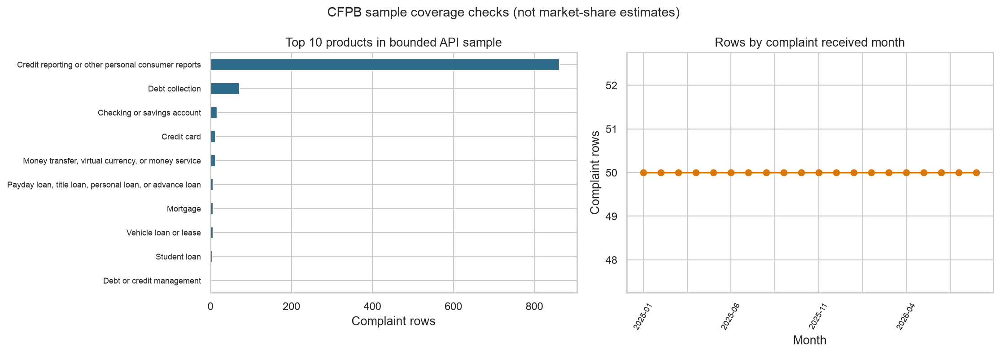

# CFPB 消费者投诉智能分析 Agent

一个本地优先、可审计的投诉分析项目：结构化问题走 DuckDB/SQL，消费者原文问题走自建的 TF-IDF + Truncated SVD 混合向量索引，综合问题由 LangGraph 编排两类工具，再通过 OpenAI Responses API 生成有口径说明和 Complaint ID 引用的回答。



## 已实现的三阶段

### 第一阶段：Narrative 数据治理

- 使用 CFPB 官方 Narrative Archive 的 2025-01-01 至 2025-02-28 快照。
- 原始 811,019 条投诉中有 265,405 条非空叙事；最短长度门禁后写入 261,447 条。
- 保留来源 URL、归档 SHA-256、输出 SHA-256、日期范围、产品分布和处理计数。
- 对官方已脱敏、消费者主动公开的文本再做一次保守的邮箱、电话、SSN 和长数字串扫描。
- 原文、向量和本地数据库全部留在本机，不提交公开 Git。

### 第二阶段：本地混合向量索引 + 自定义检索工具

- 对完全相同文本去重后得到 140,767 条唯一叙事训练池。
- 以固定种子做产品平衡抽样，索引 20,000 条投诉、25,120 个重叠文本块。
- TF-IDF 二元词组负责精确关键词召回，128 维 Truncated SVD 向量负责潜在语义召回；默认按 `0.35 × lexical + 0.65 × dense` 融合。
- 支持产品、问题、公司、日期和主题过滤，返回分项得分、原文片段、Complaint ID 和来源快照。
- 自定义工具只把 Top-K 文本交给模型；总体数量、比例和趋势禁止由 Top-K 外推。

### 第三阶段：主题分析 + SQL/RAG 混合 Agent

- 从去重语料中产品平衡抽取 30,000 条训练 12 个 NMF 描述性主题，再给 261,447 条文本批量分配主题。
- 将 228 条“月份 × 产品 × 主题”聚合写入 DuckDB，供受控 SQL 查询。
- 确定性路由把问题分为 `sql`、`rag`、`hybrid`；混合问题分别调用统计工具和原文检索工具。
- SQLGlot AST 网关限制为单条只读查询、白名单表和函数，并阻断 DuckDB 表函数形式的外部文件读取。
- Streamlit 同时展示经营 KPI、自然语言 Agent、本地文本检索、主题分布和数据质量。

## 已验证结果

| 层 | 当前验证范围 |
|---|---|
| 结构化分析 | 2025-01 至 2026-08，20 个完整月份、10,287,130 条投诉的官方聚合；1,000 条非随机质量样本 |
| Narrative | 261,447 条处理后叙事；140,767 条完全不同文本 |
| 本地索引 | 20,000 条投诉、25,120 chunks、30,000 TF-IDF 特征、128 维 SVD |
| 主题层 | 30,000 条产品平衡训练文本、12 个 NMF 主题、261,447 条全量分配、228 条月度聚合 |
| 本地检索冒烟评测 | 5 个弱标签用例中，过滤、引用和预期词覆盖均为 5/5；另有 1 个不可能过滤测试 |
| 在线编排冒烟评测 | SQL、RAG、Hybrid 共 3 个用例；路由、工具、目标表和引用要求均为 3/3，工具错误 0 |

这些是固定小型问题集上的工程验证，不是“通用准确率”。NMF 主题是关键词聚类，不是人工真值标签或因果结论。

> 投诉量不是投诉率。CFPB 数据并非消费者经历的统计代表性样本；没有市场份额分母时，不能据此评价公司质量。

## 快速运行

需要 macOS/Linux、Python 3.12 和 [uv](https://docs.astral.sh/uv/)。仓库附带结构化 Dashboard 所需的小型 Parquet；因此基础 SQL 功能不需要下载大文件。

```bash
cd "CFPB 消费者投诉智能分析 Agent"
./setup.command
./run.command
```

Dashboard、确定性 SQL 和本地向量检索不需要模型 API。自然语言 Agent 会读取当前目录或父目录的 `.env.local`：

```bash
uv run project-agent ask "2025年1月至2月，身份盗用主题有多少条？再给两个案例。"
```

## 从零重建三阶段 RAG

先把官方 ZIP 放到 `data/raw/narratives/`。本次已验证快照为 [CFPB CCDB Export: 9 January 2025 through February 2025](https://files.consumerfinance.gov/f/documents/CCDB_Export_9_January_2025_through_February_2025.zip)。

```bash
./rag_pipeline.command \
  "data/raw/narratives/CCDB_Export_9_January_2025_through_February_2025.zip"
```

脚本依次执行：叙事清洗与来源回执 → 首次混合索引 → NMF 全量主题分配 → 带主题元数据的索引重建 → DuckDB 重建 → 自动化测试 → 本地检索评测。在线 Agent 冒烟评测需单独运行，避免意外消耗 API：

```bash
uv run python scripts/evaluate_hybrid_agent.py
```

也可以直接使用自定义检索工具，不经过大模型：

```bash
uv run project-agent search "identity theft fraudulent account" \
  --product "Credit reporting or other personal consumer reports" --top-k 5
```

## 项目结构

```text
├── app.py                         # Streamlit 数据产品
├── setup.command / run.command   # 基础环境与 Dashboard
├── rag_pipeline.command           # 三阶段 Narrative/RAG 重建
├── data/
│   ├── raw/                       # 来源回执；大体积原文 ZIP 不提交
│   ├── processed/                 # 结构化数据；Narrative 产物不提交
│   ├── vector_store/              # 本地稀疏/稠密索引与模型，不提交
│   └── warehouse/                 # 本地 DuckDB，不提交
├── src/project_agent/
│   ├── retrieval.py               # 文本切块、过滤、混合召回、引用
│   ├── router.py                  # SQL/RAG/Hybrid 确定性路由
│   ├── agent.py                   # LangGraph + Responses API 工具循环
│   ├── sql_guard.py               # SQL AST 安全网关
│   ├── analytics.py               # 只读分析工具
│   └── database.py                # DuckDB 指标层
├── scripts/                       # 数据准备、索引、主题、评测
├── tests/                         # 检索、路由、SQL 安全、数据与 UI 测试
├── evaluation/                    # 固定问题集；最新运行结果不提交
├── reports/                       # 无原文的质量与主题摘要
└── docs/                          # 架构、指标、实现指南和故障复盘
```

## 设计边界

- “本地向量库”在本项目中是自建、落盘、可审计的混合向量索引，不是 Chroma/Qdrant 等独立数据库服务。
- SVD 语义能力弱于大型神经 Embedding，但无需批量上传 26 万条消费者原文，也不产生批量 Embedding API 成本。
- 检索索引使用产品平衡的 20,000 条唯一文本子集；它服务案例发现，不代表全量频率。全量计数来自 DuckDB 主题聚合。
- 官方 Narrative 已按 CFPB 标准清洗，本项目的二次扫描仍不能保证完全去标识化；任何公开展示都应避免批量发布原文。

## 技术文档

- [端到端架构与数据流](docs/architecture.md)
- [RAG 技术细节](docs/rag_architecture.md)
- [实现与验证指南](docs/implementation_guide.md)
- [指标字典](docs/kpi_dictionary.md)
- [故障与修复](docs/error_log.md)

## 官方来源

- [CFPB Consumer Complaint Database](https://www.consumerfinance.gov/data-research/consumer-complaints/)
- [CFPB Narrative Archive](https://www.consumerfinance.gov/foia-requests/foia-electronic-reading-room/cfpb-consumer-complaint-database-narratives-archive/)
- [CFPB Narrative Scrubbing Standard](https://files.consumerfinance.gov/f/documents/cfpb_narrative-scrubbing-standard_2023-05.pdf)
- [OpenAI Responses API](https://developers.openai.com/api/reference/resources/responses)
- [OpenAI Function Calling](https://developers.openai.com/api/docs/guides/function-calling)

## License

尚未选择开源许可证。公开仓库前需确认代码授权、原始数据再分发边界和学术/项目归属；不要提交 `.env.local`、运行日志、Narrative 原文、向量文件或 DuckDB。
